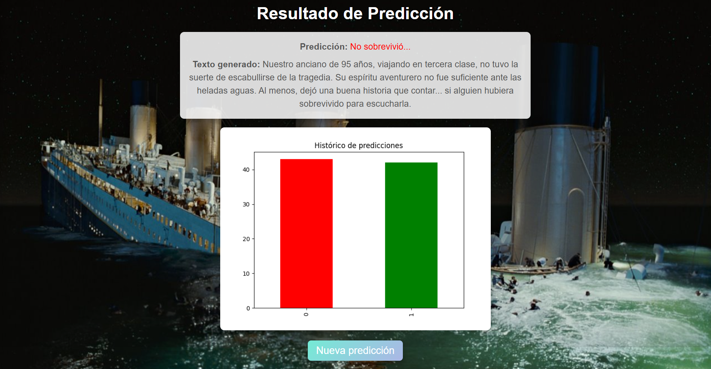

# Predicción de Supervivencia en el Titanic 🚢☠️

### Este proyecto implementa un modelo avanzado de predicción de supervivencia basado en el dataset del Titanic. La predicción se complementa con narrativas, con un toque de humor, generadas automáticamente empleando **Gemini** para personalizar las descripciones en función del resultado.

## Características 🧮
- ### **Modelo predictivo**: Regresión logística, optimizado para clasificar la supervivencia de los pasajeros según las variables `Pclass` (clase del billete), `Sex` (género) y `Age` (edad).
- ### **Narrativas personalizadas**: Generadas dinámicamente mediante **Gemini**, con esencia de cuñado y originalidad.
- ### **Interfaz web**: Uso de **Render** para mostrar su facilidad de montar una sencilla aplicación.
- ### **Visualización gráfica**: Historial de predicciones anteriores.
- ### **Base de datos**: Predicciones almacenadas en una pequeña BBDD SQLite.

## Tecnologías utilizadas 🛠️
- ### **Backend**: `Flask` para la API REST.
- ### **Modelo predictivo**: `LogisticRegression()`.
- ### **Visualización**: `Matplotlib` y `HTML` estilizado.
- ### **Generación de texto**: `gemini-2.0-flash-exp`.

## Uso ▶️
### 1. Accede al formulario web para ingresar datos como clase, género y edad del pasajero.
### 2. Obtén una predicción con narrativa personalizada y visualización gráfica del historial.
### 3. Explora los resultados, incluyendo textos generados y gráficas dinámicas.

## **Link** <<< https://titanic-survival-predictions.onrender.com >>>

## Capturas de pantalla

